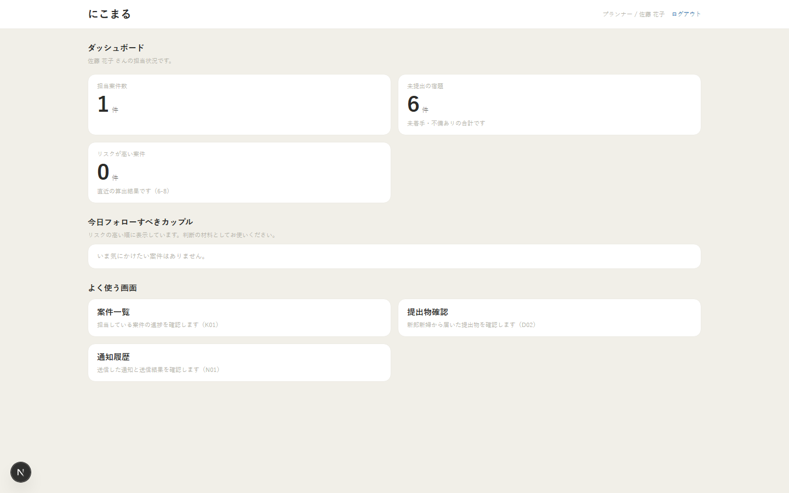
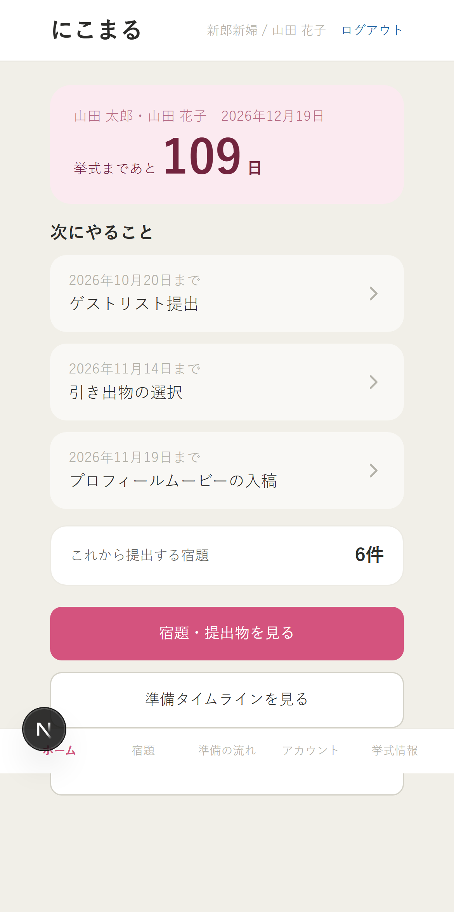
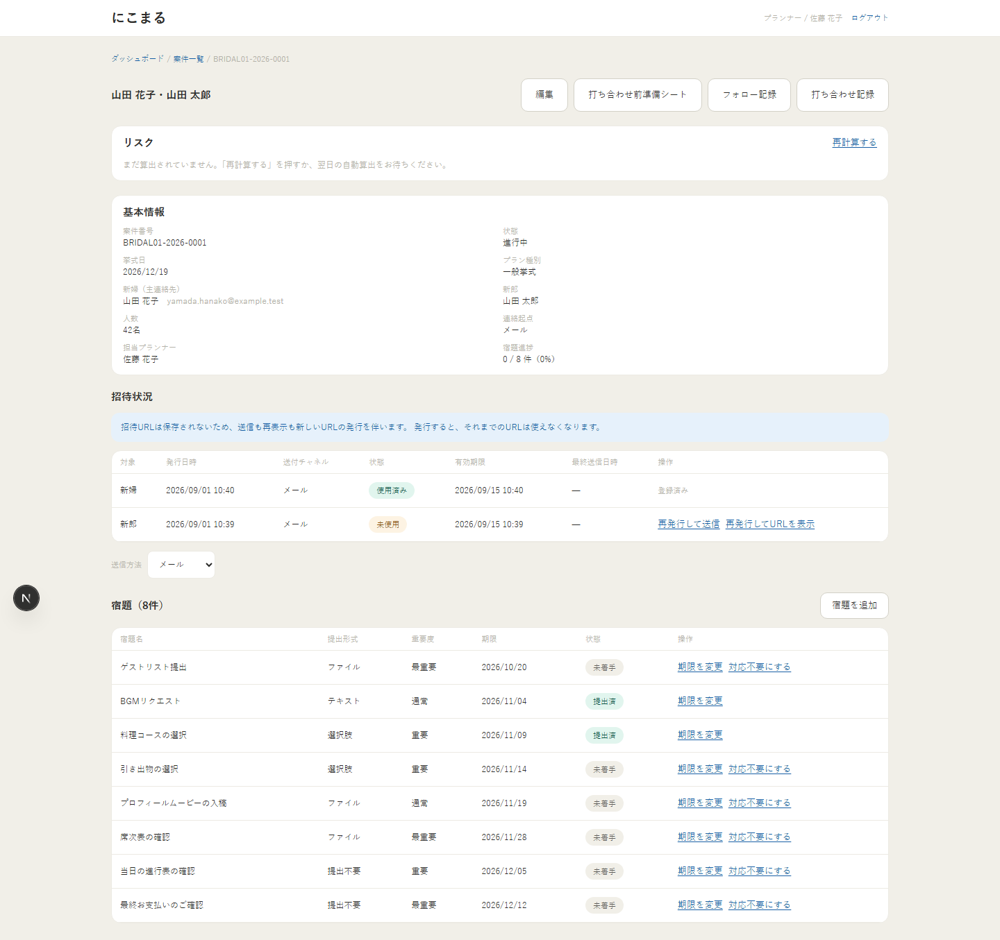
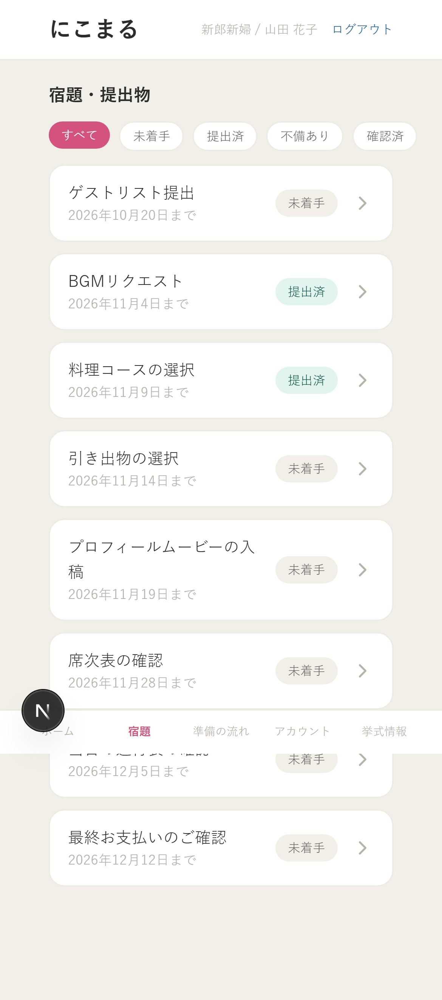
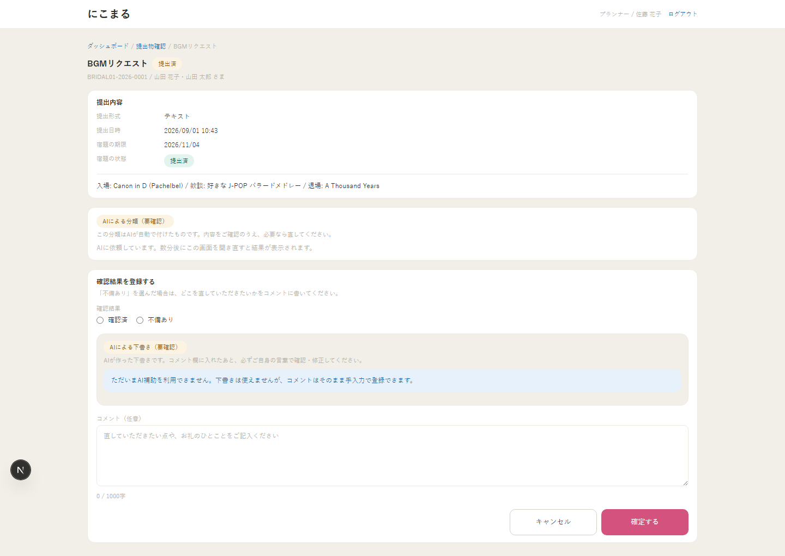
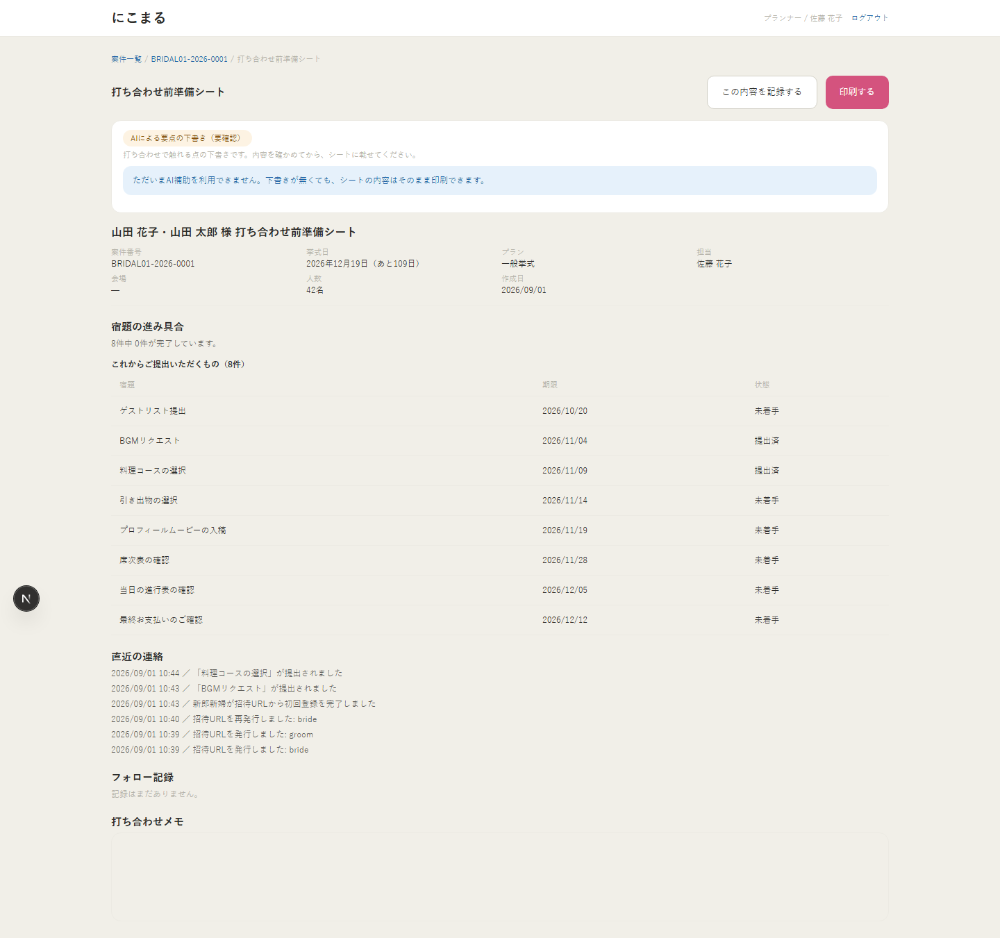

# にこまる (BridalHub)

ブライダル業界向けの業務支援アプリ。ウェディングプランナーと新郎新婦(couple)をつなぎ、
**案件管理・招待・宿題(提出物)管理・準備シート・AI補助**を提供する。卒業制作プロジェクト。

> 基本設計 **Version 1.6**。現在の機能・画面・残作業は [実装進捗一覧](docs/実装進捗一覧.md)、
> 対象commitごとの試験結果は [検証記録](docs/検証/自走完了_20261009.md) を参照。
> 今回の統合は [PR #79](https://github.com/ryuki-moro/Nicomaru/pull/79) でmainへ反映済み。共有DBへの適用と人による確認は残作業として管理する。

## 画面

模擬データ（山田太郎さん・山田花子さん）で撮影したスクリーンショット。全画面は
[docs/screenshots/](docs/screenshots/) を参照（PC版・スマートフォン版とも収録）。

| プランナー（PC）                                             | 新郎新婦（スマートフォン）                                  |
| ------------------------------------------------------------ | ----------------------------------------------------------- |
|  |  |
|              |     |

| 提出物確認（AI補助あり）                                 | 打ち合わせ前準備シート（AI補助あり）                          |
| -------------------------------------------------------- | ------------------------------------------------------------- |
|  |  |

## 現状サマリ

| 区分         | 状態・確認先                                                                                                                                 |
| ------------ | -------------------------------------------------------------------------------------------------------------------------------------------- |
| 基本設計書   | **Version 1.6**。全13章＋付録A〜D。現在のDBとの対応・追加分は[詳細設計](docs/詳細設計/README.md)を参照                                       |
| 設計レビュー | 7観点の55件を設計書へ反映。rank 1〜10の原文照合、第13章のPhase 1合意事項の記録を維持                                                         |
| 実装・統合   | 既存PRとPWA・容量集計・監視・監査・性能計測等の追加をPR #79でmainへ反映済み。機能別の状態と残作業は[進捗台帳](docs/実装進捗一覧.md)で管理    |
| 検証         | ローカル試験、CI、模擬負荷、人による試用を分けて[検証記録](docs/検証/自走完了_20261009.md)へ記載。過去版の成功を最新headの成功に読み替えない |
| デモ環境     | コード・CIと共有Supabaseへの反映を区別。[DB更新手順と適用状況](docs/DB更新手順_20261009.md)を確認。本番運用は現在予定なし                    |
| 学校成果物   | 詳細設計・中間発表資料・試験仕様・WBS等を用意。チームのレビュー、実試験、学校での発表・提出、本人の実績記入は実施記録で判断                  |

式場編集、更新APIのOrigin保護、削除バッチ・依存更新の経緯は、それぞれ
[式場編集](docs/実装計画_式場編集.md)、[API送信元検証](docs/実装計画_API送信元検証.md)、
[削除バッチと依存更新](docs/実装計画_削除バッチと依存更新.md)に保存している。
当時のPR/commitの検証記録と、現在の統合状態は区別する。

## 成果物・メンバー作業の入口

| やりたいこと                             | 開く資料                                                                                            |
| ---------------------------------------- | --------------------------------------------------------------------------------------------------- |
| 機能・画面・担当作業の進捗を確認する     | [実装進捗一覧](docs/実装進捗一覧.md) / [学校制作スケジュール](docs/学校制作スケジュール.md)         |
| 構成・ER・画面遷移・権限を確認する       | [詳細設計の案内](docs/詳細設計/README.md) / [詳細設計図PDF](docs/詳細設計/詳細設計図.pdf)           |
| 中間発表のPowerPoint・原稿を編集する     | [中間発表資料](docs/発表/中間発表/README.md)                                                        |
| 手動試験・校内模擬評価を行う             | [テスト仕様書の使い方](docs/テスト/README.md) / [テスト技法・観点](docs/テスト/テスト技法・観点.md) |
| 作業計画と本人の実績を記録する           | [WBSの使い方](docs/WBS/README.md)                                                                   |
| デモの準備・AI停止時の手動操作を確認する | [メンバー向けデモと運用手順](docs/メンバー向けデモと運用手順.md)                                    |
| AWS演習・最終発表を準備する              | [AWS演習の準備](docs/AWS演習の準備.md) / [最終発表資料](docs/発表/最終発表/README.md)               |
| 実行済み試験と未確認事項を照合する       | [検証記録](docs/検証/自走完了_20261009.md) / [PWAと性能計測](docs/PWAと性能計測.md)                 |

資料はExcel・PowerPoint・ブラウザーで編集・確認できる。開発用Agent AIの契約は不要。
学校指定の形式・持ち時間・正式担当・本人の作業時間は、チームが確認して記入する。

[学校制作スケジュール・担当区分](docs/学校制作スケジュール.md)の月別期限を基準に、前倒しで進める。
月末より早い学校の提出日・発表日を優先する。実装担当はCodexで実装・自動化を進められ、
他メンバーの作業IssueはAgent AI契約なしで実施できる手順・入力素材・完了条件を持つ。
2月の本番は学校の最終発表・デモ。WBSの実績記録は10月から始める。

## はじめて参加する人へ

GitHub を触ったことがない場合は、先に
**[docs/開発のはじめかた.md](docs/開発のはじめかた.md)** を読んでください。
アカウント作成からブランチを切って Pull Request を出すまでを、画面操作の順に書いてあります。

## セットアップ

```bash
npm install
```

環境変数は `.env.example` をコピーして `.env.local` を作る。
個人情報の暗号化鍵は 32 バイトを base64 で与える。

```bash
openssl rand -base64 32
```

### 開発サーバー

```bash
npm run dev
```

### デモ・テスト用の模擬データ

```bash
npx supabase start   # ローカル Supabase（Docker が必要）
npm run demo:seed    # 架空のプランナー1人・案件5件を入れる。作り直しは npm run demo:reset
```

環境は「ローカル」「CI」「共有デモ環境（必要な場合のみ）」の3つだけで、本番・ステージングは作らない。
接続先・データの扱い・共有デモ環境の準備は **[docs/環境の使い分け.md](docs/環境の使い分け.md)** を参照。

### 検証

```bash
npm test
```

`npm test` は次の2種類を通しで実行する。

- **RLSテスト** (`tests/db/`) — [PGlite](https://pglite.dev/)(WASM PostgreSQL) 上に
  `supabase/migrations/` をそのまま適用し、第11章の合格基準を機械検証する。
  Docker も Supabase CLI も不要なので、CI と開発機で同じテストが動く。
  42P17(ポリシーの相互再帰)・権限昇格・アーカイブ済み案件の保護・停止利用者の遮断・
  memo の列レベル遮断・招待の可視範囲を毎回確認する。
- **ユニットテスト** (`tests/unit/`) — タイムライン逆算、案件更新時の期限再計算、
  リスクスコア算出、暗号化と検索用ハッシュ、招待トークン。
  設計書の仕様からテストを先に用意し、実装を合わせている(12-2)。

```bash
npm run lint       # ESLint (Service Role Key の範囲外使用を機械検出)
npm run typecheck  # tsc --noEmit (strict)
npm run build      # 本番ビルド
```

#### 並行性テスト (実 PostgreSQL が必要)

PGlite は単一接続なので、設計が明示する「同時リクエストでも壊れない」性質だけは検証できない。
実サーバーへ同時接続して確かめる分は `tests/db/concurrency.test.ts` に分けてある
(招待トークンの原子的消費 6-6-1、レート制限 5-3、case_code の採番競合 5-7、最新提出の一意性 6-7)。

`TEST_PG_URL` が無ければ skip されるので、通常の `npm test` は接続情報なしで完結する。
CI では Postgres サービスコンテナを使って毎回実行している。

ローカルで動かす場合 (管理者権限もサービス登録も不要。フォルダを消せば元に戻る):

```bash
C:\tools\pgsql\bin\pg_ctl -D C:\tools\pgdata-nicomaru -o "-p 5433 -c listen_addresses=127.0.0.1" -l server.log start
```

```bash
TEST_PG_URL=postgres://postgres:<password>@127.0.0.1:5433/postgres npm run test:pg
```

## リポジトリ構成

| パス                                                         | 内容                                                                     |
| ------------------------------------------------------------ | ------------------------------------------------------------------------ |
| `docs/にこまる_要件定義書_完成版.docx`                       | 要件定義書(設計の照合元・正)                                             |
| `docs/BridalHub_基本設計書.docx`                             | 基本設計書 本体(**Version 1.6**。改訂履歴は文書情報を参照)               |
| `docs/BridalHub_基本設計書_レビュー結果.md`                  | 設計レビュー結果(55件の指摘詳細・承認判断)                               |
| `docs/画面設計/`                                             | サイトマップ・画面案(pptx)                                               |
| `src/app/globals.css` / `src/components/ui/`                 | 現在の共通スタイル・UI部品                                               |
| `docs/実装進捗一覧.md` / `docs/implementation-progress.json` | 全機能・画面・実装不足・運用・検証・制作の進捗台帳                       |
| `docs/学校制作スケジュール.md`                               | 10月〜翌2月の学校成果物、期限・担当区分・実績記録の方針                  |
| `supabase/migrations/`                                       | DDL・RLS共通関数・全ポリシー・インデックス                               |
| `supabase/seed.sql`                                          | 式場1件・プラン種別4種・宿題テンプレート・リスクルール                   |
| `src/lib/`                                                   | 定数(表6-9 の単一ソース)・エラー体系・暗号化・招待・スケジュール・リスク |
| `src/app/`                                                   | 画面(App Router)と Route Handler                                         |
| `scripts/demo/`                                              | デモ・テスト用の模擬データ(架空の案件5件)と投入処理                      |
| `tests/`                                                     | RLSテスト・ユニットテスト・並行性テスト                                  |
| `worker/`                                                    | AIジョブワーカー(ローカルLLMサーバー上で動かす。Phase 3)                 |
| `TASKS.md`                                                   | 残作業の入口・フェーズ計画・過去の実装/設計記録                          |

## 設計上の技術構成 (設計書 v1.2 より)

| 層                    | 採用                                                                              | 備考                                                                                                         |
| --------------------- | --------------------------------------------------------------------------------- | ------------------------------------------------------------------------------------------------------------ |
| フロント/ホスティング | Next.js 15 (App Router) + Vercel (Hobby枠)                                        | 制約起点で構成決定                                                                                           |
| DB / 認可             | Supabase (PostgreSQL + RLS + Auth + Storage)                                      | RLSで permissive/restrictive 結合                                                                            |
| 認証                  | couple=マジックリンク＋6桁ワンタイムコード / staff=メール＋パスワード(12文字以上) | LINE内ブラウザのブラウザ跨ぎ対応                                                                             |
| 個人情報              | アプリ側 AES-256-GCM ＋ 検索用 HMAC-SHA256 列                                     | 等値一致検索のみ(13-1)                                                                                       |
| 定期処理              | pg_cron (死活監視のみ GitHub Actions)                                             | 一覧は 6-12                                                                                                  |
| AI補助                | ローカルLLM (Ollama) をプル型ジョブで内製、RAG は pgvector                        | Phase 3。生成エンジンは校内サーバー非公開。ワーカーには Service Role Key を配らず2関数だけを専用ロールへ付与 |
| 通知                  | LINE Messaging API / メール(Resend)                                               | Auth メールも Resend を Custom SMTP として使用                                                               |

## 設計上の要点(実装で踏み外しやすいところ)

- **RLS の共通関数は再帰回避のために必須**。ポリシー式から `user_profiles` /
  `couple_profiles` / `wedding_cases` を直接参照すると 42P17 で主要画面が落ちる。
  すべて `accessible_case_ids()` などの security definer 関数を経由する(付録A)。
- **permissive ポリシーの WITH CHECK は OR 結合される**。値域だけを見る WITH CHECK は
  別ポリシーの USING と組み合わさって権限昇格になる。USING と WITH CHECK の両方に
  同じロール条件を置く(RLSテストで検出済み)。
- **`couple_profiles` は `select *` が 42501 になる**。`memo` を列レベル権限で剥奪しているため、
  参照列は `COUPLE_PROFILE_COLUMNS` を使う。
- **提出は「案件」単位**。新郎新婦は1つの案件・同じ宿題を共有し、最新提出も1件だけ持つ。
  上書き条件に提出者の一致を加えると、相手が一時保存しただけでもう一方が提出できなくなる(6-7)。
- **平文の招待トークンは保存しない**。既発行の招待URLを後から表示・再送することはできず、
  送信・URL再表示は必ず再発行(既存を `revoked_at` で失効 → 新規行)を伴う(6-3-6 / K02)。
- **Service Role Key は使用範囲表(6-3-5 表6-4)にある用途のみ**。
  `createSupabaseAdminClient(useCase)` で用途を明示し、範囲外の参照は ESLint が落とす。
- **後から作った表は grant を個別に付ける**。`grant ... on all tables` は実行時点で存在した表にしか
  効かないので、RLSポリシーを書いても permission denied で止まる。
- **`/api/internal/**` と `/api/health` は middleware の除外対象**。
  除外しないと pg_cron からの定期処理が 307 で全滅する。認証は共有シークレットが担う(6-5-2)。
- **`/api` 配下は未認証でもログイン画面へリダイレクトしない**。リダイレクトすると
  クライアントがログイン画面のHTMLを受け取り、6-5-1 のエラー形式で扱えなくなる。
- **更新APIは共通`route()`を使い、同一Originを必須にする**。認証前のAPIも含む。
  `APP_BASE_URL`と異なるOriginやOrigin欠落は、認証・本文解析・DB処理より前に403を返す。
  正しいOriginでの未認証は従来どおり401。通常のブラウザー`fetch`はOriginを自動送信する。
  curl等で直接確認する場合は`Origin: <APP_BASE_URLのscheme+host+port>`を付ける（利用者認証は別途必要）。
  内部cronだけは`route(handler, { source: 'internal-cron' })`で共有secret認証を必須にする。
  LINE Webhookは独立したraw body署名検証を維持し、LINE連携の`/api/line/link`は通常のOrigin検証対象。
  [対象・検証計画](docs/実装計画_API送信元検証.md)と`tests/unit/api-origin.test.ts`を参照。

## フェーズ計画

- **Phase 1**: コア導線(案件登録 → 招待 → 初回登録 → 提出 → 確認)と共通要件を実装。現在の統合・検証状態は進捗台帳を参照。
- **Phase 2**: LINE起点導線・リスク・通知・準備シート・system_admin画面に、容量集計・監視を追加。共有デモ環境での設定・稼働確認は別に記録する。
- **Phase 3**: AI補助(9-1〜9-6)のコードあり。デモでの動作/停止時操作・品質評価は別途確認。
  Phase 1〜2 と疎結合で、ローカルLLMが止まっていてもコア機能は維持する。
  ワーカーの心拍が10分途切れたら画面を「利用不可」に切り替え、手動運用へ倒す。
- **Phase 3拡張**(9-7〜9-11): 将来の条件付きスコープ。実式場での実証と採用範囲を別途合意した場合に判断。今回の校内模擬評価だけで着手条件を満たした扱いにしない。

学校の製造・試験・資料・発表を、模擬データで再現できる環境と手順で進める。
定期バックアップ・常時稼働・商用プラン移行は将来候補として区別する。
詳細は [TASKS.md](TASKS.md) と [月別成果物Epic](https://github.com/ryuki-moro/Nicomaru/issues/53) を参照。
