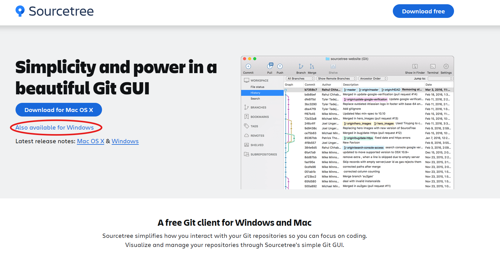
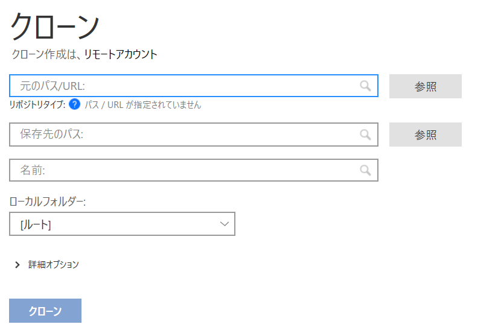
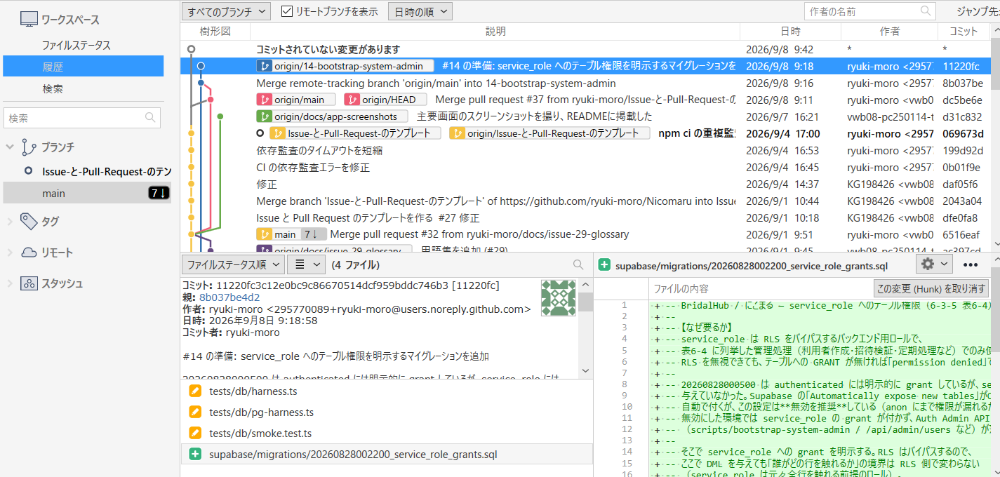
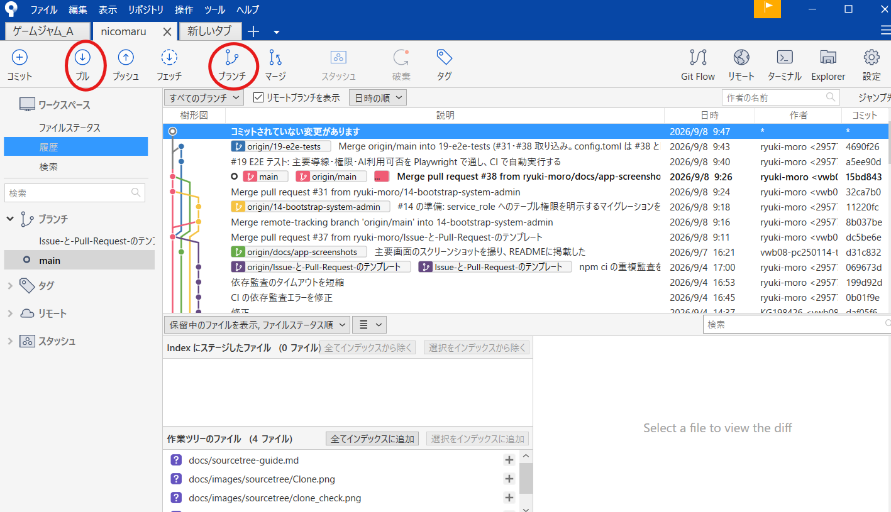
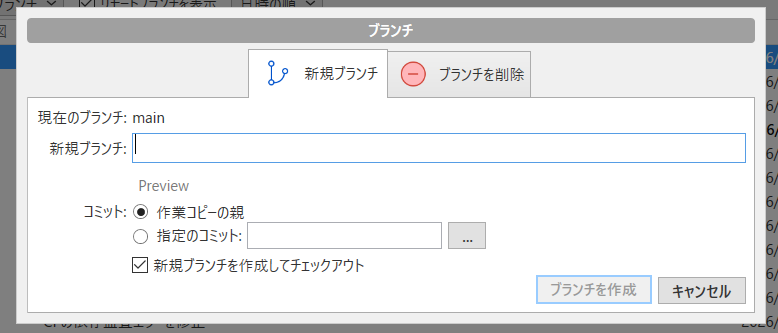

# SourceTree のインストールと Nicomaru のクローン

このページでは、Windows に SourceTree を入れて、GitHub にある Nicomaru のリポジトリを自分のPCへコピーする手順を説明します。
Git や GitHub に慣れていない場合は、上から順番に進めてください。

## 事前に用意するもの

- GitHub アカウント
- `ryuki-moro/Nicomaru` リポジトリへの招待

まず、ブラウザで <https://github.com/ryuki-moro/Nicomaru> を開きます。ファイル一覧が表示されれば、リポジトリへのアクセス権があります。
表示されない場合は、GitHub にログインしているアカウントが正しいか確認し、それでも解決しなければプロジェクトの管理者に連絡してください。

## 1. SourceTree をダウンロードする

1. SourceTree の公式サイト <https://www.sourcetreeapp.com/> を開く。
2. `Download for Windows` を押す。
3. ダウンロードされたインストーラーを実行する。



公式サイト以外から入手したインストーラーは使用しないでください。

## 2. SourceTree をインストールする

インストーラーを起動すると、Git の設定を確認する画面が表示されます。

1. ライセンスを確認して同意する。
2. Git の選択画面では、Git が未インストールなら `Embedded Git` を選ぶ。
3. Mercurial の設定が表示された場合は、今回使わないためインストールしない。
4. SourceTree の登録画面が表示されたら、必要に応じて Atlassian アカウントを作成またはログインする。

Git を別途インストール済みの場合でも、特別な理由がなければ `Embedded Git` のままで構いません。

## 3. GitHub アカウントを認証する

SourceTree を起動し、認証設定を開きます。

1. メニューの `ツール` → `オプション` を開く。
2. `認証` タブを選ぶ。
3. `追加` を押す。
4. `ホスティングサービス` で `GitHub`、`認証` で `OAuth` を選ぶ。
5. `OAuthトークンを取得` または同じ意味のボタンを押す。
6. ブラウザで GitHub にログインし、SourceTree からの認証を許可する。
7. SourceTree に GitHub アカウントが追加されたことを確認する。

画面の表記は SourceTree のバージョンや表示言語によって少し異なる場合があります。パスワードやアクセストークンを、このガイドやチャット、Issue に貼り付けないでください。

## 4. Nicomaru をクローンする

クローンとは、GitHub 上のリポジトリを自分のPCにコピーすることです。

1. SourceTree の `新規` を押す。
2. `URLからクローン` を選ぶ。
3. 次のURLを `ソースURL` に入力する。

```text
https://github.com/ryuki-moro/Nicomaru.git
```



4. `保存先のパス` に、リポジトリを保存するフォルダを指定する。
5. `名前` が `Nicomaru` になっていることを確認する。
6. `クローン` を押す。

### 保存先について

保存先は、たとえば次のような自分が分かりやすい場所にしてください。

```text
C:\work\Nicomaru
```

次の場所は避けてください。

- OneDrive など、他の端末と自動同期されるフォルダ
- パスに日本語やスペースが多く含まれる場所
- `C:\Program Files` など、書き込みに管理者権限が必要な場所

すでに同じ名前の `Nicomaru` フォルダがある場合は、別の空の保存先を指定してください。クローン先は空のフォルダにするのが安全です。

## 5. クローンできたか確認する

クローンが終わると、SourceTree に Nicomaru の画面が開きます。次を確認してください。

- 左側または上部に `main` ブランチが表示されている
- 履歴にコミットが表示されている
- ファイル一覧に `package.json`、`src`、`supabase` がある
- リモートのURLが `https://github.com/ryuki-moro/Nicomaru.git` になっている



ファイルを確認するには、SourceTree の `作業ツリー` 付近にあるリポジトリフォルダを開く操作を使うか、エクスプローラーで指定した保存先を開きます。

## 6. 作業用ブランチを作る

ブランチは、`main` を直接変更せずに作業するための自分専用の作業場所です。作業を始める前に、必ずブランチを作成してください。

### まず main を最新にする

1. SourceTree の左側にある `ブランチ` → `ローカル` から `main` をダブルクリックする。
2. 上部の `プル` を押す。
3. `main` の変更が取り込まれたことを確認する。



### ブランチを作成する

1. 上部の `ブランチ` を押す。
2. ブランチ名を入力する。
3. `新しいブランチを作成` または `ブランチを作成` を押す。

ブランチ名は、次の形式にしてください。

```text
feature/issue-19-e2e-core-flow  新しく作るもの
fix/issue-12-login-bug          不具合を直すもの
docs/issue-29-glossary           文書を書くもの
```



Issue番号を名前に入れると、誰がどの作業をしているか分かりやすくなります。ブランチを作成したら、SourceTree上でそのブランチが選択されていることを確認してから作業を始めてください。

## 7. 変更をコミットする

コミットは、作業内容を記録するセーブポイントです。キリのよいところで、変更を小さく分けてコミットしてください。

### コミットの手順

1. ファイルを編集して保存する。
2. SourceTreeを開くと、`作業ツリーの変更` に変更したファイルが表示される。
3. コミットに含めるファイルにチェックを入れる。
4. 画面下部のメッセージ欄に、作業内容を入力する。
5. `コミット` を押す。

コミット前に、表示されている差分を確認してください。今回の作業と関係のないファイルが含まれている場合は、そのファイルのチェックを外します。

### コミットメッセージの書き方

何を変更したかが分かる短い文章にし、末尾にIssue番号を付けます。

```text
ユーザーログイン時のエラーを修正 (#12)
```

次のように、作業内容をそのまま書けば十分です。

```text
SourceTreeの操作ガイドを追加 (#29)
提出画面のテストを追加 (#19)
```

コミットが完了すると、SourceTreeの履歴に新しいコミットが表示されます。コミットしただけではGitHubには送信されないため、GitHubへ保存するには次のプッシュ操作が必要です。

## 8. ブランチからPull Requestを作る

Pull Request（プルリクエスト）は、作業ブランチで行った変更を `main` に取り込んでもらうためのレビュー依頼です。コミットが終わったら、作業ブランチをGitHubへプッシュしてから作成します。

### ブランチをGitHubにプッシュする

1. SourceTree上で、作業したブランチが選択されていることを確認する。
2. 上部の `プッシュ` を押す。
3. プッシュするブランチにチェックを入れる。
4. `追跡ブランチを設定` または同じ意味の項目が表示されたら有効にする。
5. `プッシュ` を押す。

初回のプッシュでは、GitHubへのログインや認証を求められる場合があります。

### GitHubでPull Requestを作成する

1. ブラウザで <https://github.com/ryuki-moro/Nicomaru> を開く。
2. `Compare & pull request` または `Pull requests` → `New pull request` を押す。
3. 取り込み先（base）が `main`、変更元（compare）が自分の作業ブランチになっていることを確認する。
4. タイトルに変更内容を短く入力する。
5. 説明欄に、次の内容を書く。
   - 何を変更したか
   - 実施した確認やテスト
   - 関連するIssue番号（例: `Closes #12`）
6. 必要ならレビュアーを選ぶ。
7. `Create pull request` を押す。

作成後は、指摘や確認依頼がないかPull Requestを確認してください。修正が必要な場合は、同じブランチで修正してコミット・プッシュすると、作成済みのPull Requestに自動で反映されます。

`main` に直接プッシュしたり、Pull Requestを作成せずに作業を終えたりしないでください。
